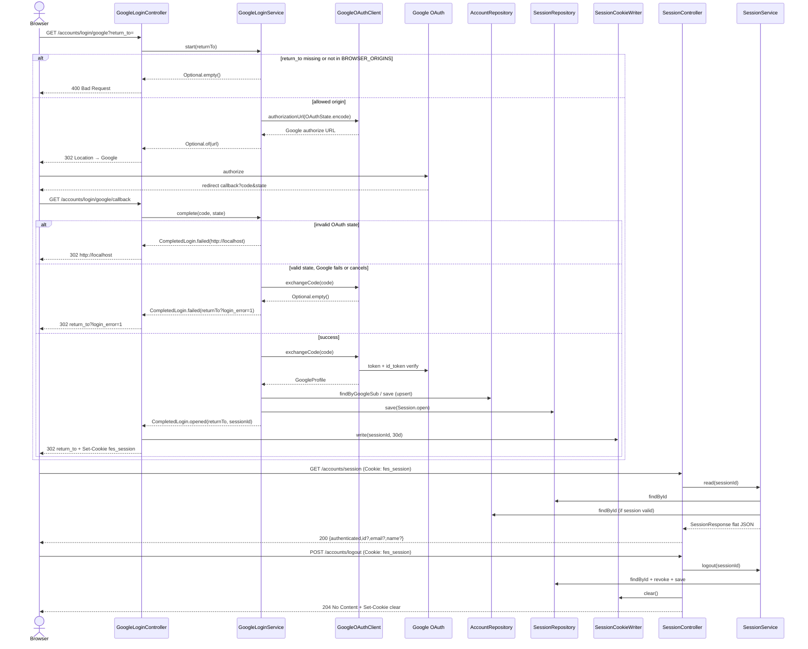

# UML 001 — Sesión Google compartida

Diagramas del código **implementado** en la rama `001/feat-shared-google-session` (no del plan aspiracional original). La organización es **Layered** (`controller` / `service` / `model` / `repository` / `config`), no Clean Architecture por capacidades.

## Diagrama de secuencia

Flujo: inicio de login → Google → callback → lectura de sesión → logout.

## Diagrama de clases

Clases reales del paquete `com.friendlyeshop.account` involucradas en auth/sesión.

```mermaid
classDiagram
    direction TB

    class GoogleLoginController {
        -GoogleLoginService googleLoginService
        -SessionCookieWriter sessionCookieWriter
        +start(returnTo) ResponseEntity~Void~
        +callback(code, state) ResponseEntity~Void~
    }

    class SessionController {
        -SessionService sessionService
        -SessionCookieWriter sessionCookieWriter
        +session(sessionId) SessionResponse
        +logout(sessionId) ResponseEntity~Void~
    }

    class SessionCookieWriter {
        <<component>>
        +COOKIE_NAME : String = "fes_session"
        -AuthProperties authProperties
        +write(sessionId, maxAge) ResponseCookie
        +clear() ResponseCookie
    }

    class GoogleLoginService {
        -AuthProperties authProperties
        -GoogleOAuthClient googleOAuthClient
        -AccountRepository accountRepository
        -SessionRepository sessionRepository
        +start(returnTo) Optional~String~
        +complete(code, state) CompletedLogin
    }

    class SessionService {
        -SessionRepository sessionRepository
        -AccountRepository accountRepository
        +read(sessionId) SessionResponse
        +logout(sessionId) void
    }

    class GoogleOAuthClient {
        <<component>>
        -AuthProperties authProperties
        +authorizationUrl(state) String
        +exchangeCode(code) Optional~GoogleProfile~
    }

    class OAuthState {
        <<utility>>
        +encode(returnTo)$ String
        +returnTo(state)$ Optional~String~
    }

    class Account {
        <<entity>>
        -UUID id
        -String googleSub
        -String email
        -String displayName
        -String passwordHash
        -String role
        -Instant createdAt
        -Instant updatedAt
        +open(googleSub, email, displayName, now)$ Account
        +updateProfile(email, displayName, now) void
    }

    class Session {
        <<entity>>
        -UUID id
        -UUID accountId
        -Instant createdAt
        -Instant expiresAt
        -Instant revokedAt
        +DEFAULT_TTL_DAYS : int = 30
        +open(accountId, now)$ Session
        +revoke(now) void
        +isValid(now) boolean
    }

    class SessionResponse {
        <<record>>
        +boolean authenticated
        +UUID id
        +String email
        +String name
        +anonymous()$ SessionResponse
        +authenticated(id, email, name)$ SessionResponse
    }

    class CompletedLogin {
        <<record>>
        +boolean success
        +String redirectUrl
        +UUID sessionId
        +opened(redirectUrl, sessionId)$ CompletedLogin
        +failed(redirectUrl)$ CompletedLogin
    }

    class GoogleProfile {
        <<record>>
        +String subject
        +String email
        +String name
    }

    class AccountRepository {
        <<interface>>
        +findByGoogleSub(googleSub) Optional~Account~
    }

    class SessionRepository {
        <<interface>>
    }

    class AuthProperties {
        -String googleClientId
        -String googleClientSecret
        -String sessionCookieDomain
        -List~String~ browserOrigins
        -boolean cookieSecure
        -String publicApiBaseUrl
    }

    class AuthConfig
    class CorsConfig {
        +addCorsMappings(registry) void
    }

    GoogleLoginController --> GoogleLoginService
    GoogleLoginController --> SessionCookieWriter
    SessionController --> SessionService
    SessionController --> SessionCookieWriter
    SessionCookieWriter --> AuthProperties
    GoogleLoginService --> GoogleOAuthClient
    GoogleLoginService --> AccountRepository
    GoogleLoginService --> SessionRepository
    GoogleLoginService --> AuthProperties
    GoogleLoginService ..> OAuthState
    GoogleLoginService ..> CompletedLogin
    GoogleLoginService ..> GoogleProfile
    GoogleLoginService ..> Account
    GoogleLoginService ..> Session
    SessionService --> AccountRepository
    SessionService --> SessionRepository
    SessionService ..> SessionResponse
    SessionService ..> Account
    SessionService ..> Session
    GoogleOAuthClient --> AuthProperties
    GoogleOAuthClient ..> GoogleProfile
    AccountRepository ..> Account
    SessionRepository ..> Session
    AuthConfig ..> AuthProperties
    CorsConfig --> AuthProperties
    JpaRepository <|-- AccountRepository
    JpaRepository <|-- SessionRepository
```

### Notas de contrato (código real)

- **Session JSON** plano: `{ "authenticated": false }` o `{ "authenticated": true, "id", "email", "name" }` — sin objeto `account` anidado (`SessionResponse`).
- **Logout**: `POST /accounts/logout` → **204 No Content** + `Set-Cookie` que borra `fes_session` (cuerpo vacío).
- **Cookie** `fes_session`: HttpOnly, SameSite=Lax, Path=/, Domain=`SESSION_COOKIE_DOMAIN`, Secure=`SESSION_COOKIE_SECURE`.
- **OAuth state**: Base64 URL-safe opaco de `UUID|returnTo` (`OAuthState`); no firmado.
- **State inválido** en callback: redirect a `http://localhost` (comportamiento implementado en `GoogleLoginService.complete`).
